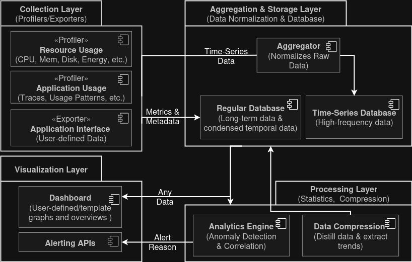

# Software Monitoring
Toolkit for deploying a dashboard stack, from metric collection to visualization using Docker.

Within this project you will find directories that contain building blocks for deploying various services that can be used for collecting, storing, and visualizing metrics. Each service has its own directory containing the necessary configuration files and deployment files.

The blueprint below illustrates the general architecture of the stack, from metrics collection to visualization:



## General Deployment Process

In order to deploy the selection of services, each service has its own deployment file which contains the necessary configuration, such as environment variables, volumes, and network settings.

The environment variables are stored in the `.env` file, which is not included in the repository for security reasons. An example file `.env.example` is provided to illustrate the required variables. These variables include:
- `DB_USERNAME`: The username for the PostgreSQL database.
- `DB_PASSWORD`: The password for the PostgreSQL database.
- `ADMIN_USERNAME`: The username for the Grafana admin user.
- `ADMIN_PASSWORD`: The password for the Grafana admin user.

**Note:** Although this `.env` file is required for deployment, the values defined in it do not represent an exhaustive list nor do they represent mandatory variables. The general note is that for each service, the necessary environment variables should be defined in the `.env` file.

### Deploying with individual files

To deploy the services, use the following command, replacing `<service-file>` with the path to the desired service deployment file (e.g., `storage/postgres.yml`):

```bash
docker compose --env-file .env -f <service-file> up -d
```

You can also deploy multiple services at once by specifying multiple `-f` flags:

```bash
docker compose --env-file .env -f storage/postgres.yml -f storage/prometheus.yml up -d
```

**Note:** Some of these services may depend on each other. For example, Grafana requires a running database service (such as Prometheus) to fetch data from. Ensure that you deploy the services in the correct order or deploy all necessary services together.

In order to ensure that your services are deployed correctly, their configuration files contain `depends_on` directives where applicable. This ensures that dependent services are started before the service that relies on them.

### Deploying with a single file
We recommend deploying the services in a single file by copying the building blocks, as this allows for easier customization and understanding of the deployment process as well as making it easier to bring the stack up and down.

To do so, create a new file named `deployment.yml` and copy the contents of each service's deployment file into it. Then, you can deploy the entire stack with the following command*:

   ```bash
   docker compose --env-file .env -f deployment.yml up -d
   ```

**Note:** When merging the deployment files, ensure that there exists only one `services:` and one `volumes:` section in the final `deployment.yml` file. You may need to adjust the indentation accordingly. You can see how such a merger would look in the provided `deployment.yml` file in the `examples/scaphandre-prometheus-grafana` directory.

*Some services may require additional configuration steps, such as adding scrape targets to Prometheus or provisioning data sources in Grafana. Refer to the documentation of each service for more details on these steps.
